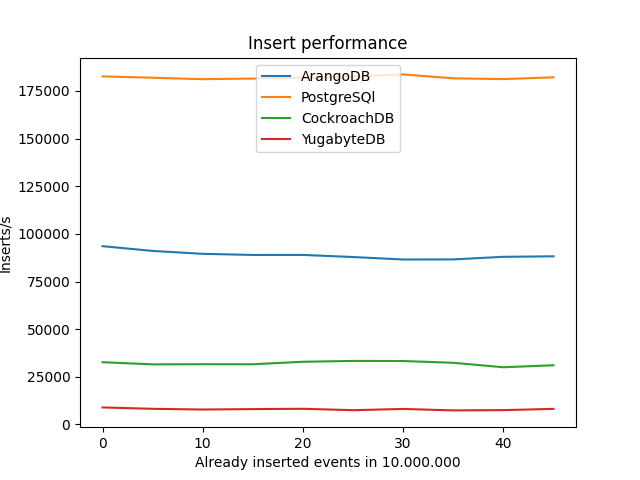

# Old test results

This page contains the results from our first round of testing. During that round we did not always provide the optimal resources for each database, did not have specific optimizations in place and due to the tests stretching over several weeks could not guarantee the same environment between tests. So treat these results with a grain of salt.

## Raw results starting with an empty database

All values as inserts per second. Average value of 3 runs. All runs were done with 1 million inserts per worker starting with an empty database.

### Single-node database

|                                             | PostgreSQL | CockroachDB | YugabyteDB | ArangoDB | Cassandra sync | Cassandra async |
|---------------------------------------------|------------|-------------|------------|----------|----------------| ----------------|
| no batch, 16 workers, client-generated PK   |  12500     |  3850       | 2600       |   7000   |  -             | -               |
| no batch, 16 workers, db-generated PK       |  12500     |  3900       |  850       |   7000   |  -             | -               |
| batch 10, 16 workers, fastest PK mode       |  36900     |  3100       | 1600       |  51000   |  -             | -               |
| batch 100, 16 workers, fastest PK mode      |  44000     |  3730       | 2170       | 135000   |  -             | -               |
| batch 1000, 16 workers, fastest PK mode     |  44000     |  3830       | 2250       | 153000   |  -             | -               |
| values-lists 100 rows, 16 workers           | 190000     | 31000       | 6550       |          |  -             | -               |
| values-lists 1000 rows, 16 workers          | 175000     | 33000       | 7100       |          |  -             | -               |

### Multi-node database

All results with 16 workers, client-generated primary key for YugabyteDB and db-generated for the others.

|                     | CockroachDB | YugabyteDB | ArangoDB |
|---------------------|-------------|------------|----------|
| 3 nodes, no batch   | 4200        | 2950       |   4500   |
| 5 nodes, no batch   | 4500        | 4270       |   4500   |
| 3 nodes, batch 100  | 5400        | 2180       |  83100   |
| 3 nodes, batch 1000 | 4600        | 2350       | 100000   |
| 5 nodes, batch 100  | 5860        | 2600       |  74000   |
| 5 nodes, batch 1000 | 5210        | 3650       |  95000   |

### Multi-node database with increased resources

The results above were gathered with all the databases deployed with the default resource settings of their respective helm charts. As this would typically not be the deployment mode for a production installation we also ran the tests with the databases configured with more resources (for Yugabyte based on recommendations in their community slack). The values files in the `dbinstall` folder contain the increased settings commented out. These are the results:

|                     | CockroachDB | YugabyteDB | ArangoDB | Cassandra sync | Cassandra async |
|---------------------|-------------|------------|----------|----------------| ----------------|
| 3 nodes, no batch   |  5000       | 7180       |   6300   |  30000         | 97500           |
| 5 nodes, no batch   |  5000       | 8550       |   6300   |  30000         | 97500           |
| 3 nodes, batch 100  | 14700       | 5270       |  95000   |  147000        | 473000          |
| 3 nodes, batch 1000 | 14900       | 5640       | 110000   |  427000        | 437000          |
| 5 nodes, batch 100  | 15530       | 7000       |  80000   |  160000        | 660030          |
| 5 nodes, batch 1000 | 15000       | 8000       | 101000   |  590000        | 646000          |

CockroachDB and YugabyteDB benefit the most from more resources and can increase their performance in average by a factor of 2 to 3. ArangoDB also shows an increase but not as pronounced as the others. Not shown here are results for PostgreSQL which stay roughly the same.

### Fill level insert performance

As described in the run options, this test measures the performance of the databases with increasing table data fill levels. Depending on the database and taking spread into account, performance will dip a bit with higher fill levels but all in all remains quite stable. Tests were done with 16 workers and databases (except postgres) configured with 3 nodes (not configured with increased resource settings). Fastest mode was used (values-lists). We only tested with up to 500 million entries which is not much for an IoT project. If you are considering using one of these database you should run the tests with a realistic amount of data for your project.

